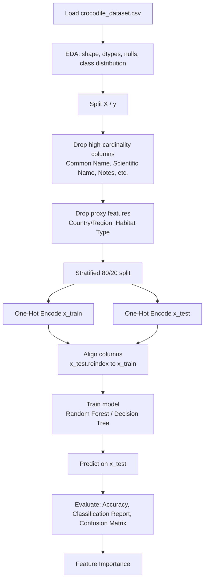

# Crocodile Conservation Status — Random Forest vs Decision Tree

A Pandas + Scikit-Learn practice exercise: predicting the `Conservation Status` of crocodile species from individual-level measurements, using two different classifiers (Random Forest and Decision Tree) on the same preprocessing pipeline.

More than the models themselves, this exercise ended up being about **detecting and fixing two forms of data leakage** that were artificially inflating accuracy.

## Dataset

[Global Crocodile Species Dataset](https://www.kaggle.com/datasets/zadafiyabhrami/global-crocodile-species-dataset) — 1000 observations, 14 columns. *(Check the original dataset's license before redistributing the CSV in this repo.)*

## Pipeline

## Findings

### 1. Leakage from encoding order
The original script applied `pd.get_dummies` on the full dataset **before** the train/test split. The order was fixed: split first, then encode `x_train`/`x_test` separately, with `reindex` to align columns between both sets.

### 2. Leakage from geographic proxy variables
`Conservation Status` is a fixed attribute of the species (not the individual). `Country/Region` and `Habitat Type` turned out to be near 1:1 proxies for species identity, letting the model "guess" the status without learning any real biological relationship.

| Features used | Accuracy |
|---|---|
| With `Country/Region` + `Habitat Type` | 98.5% |
| Without those two columns | ~48–52% |

Both columns were dropped from the final feature set, leaving only biological and demographic variables (`Observed Length`, `Observed Weight`, `Age Class`, `Sex`).

### 3. Random Forest vs Decision Tree

Same pipeline, same `random_state`, features already cleaned of proxies:

| Model | Train accuracy | Test accuracy |
|---|---|---|
| Random Forest | 99.9% | 51.5% |
| Decision Tree | 99.9% | 48.5% |

Both memorize the training set (no depth restriction applied); Random Forest generalizes slightly better thanks to averaging across multiple trees, though with only 4 features and a 200-row test set the margin is small.

## Files

- `random-forest-classifier-crocodile-dataset.ipynb`
- `decision-tree-classifier-crocodile-dataset.ipynb`

## How to run

Both notebooks are set up for Kaggle (they use the `/kaggle/input/...` path). To run them locally, update the `pd.read_csv` path to point to the local CSV.

## Links

- Kaggle notebook: *(add link)*
- LinkedIn post: *(add link)*

## License

MIT (own code). Check the original dataset's license before redistributing the CSV.
