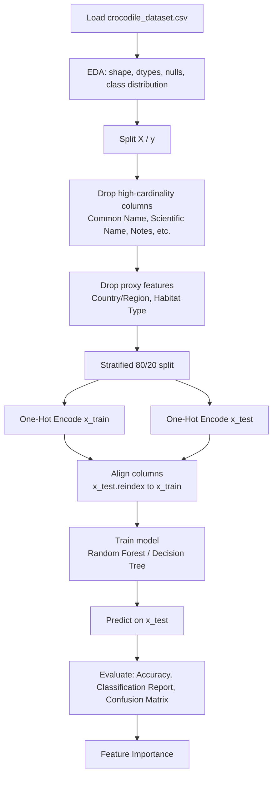

# Crocodile Conservation Status — Random Forest vs Decision Tree

A Pandas + Scikit-Learn practice exercise: predicting the `Conservation Status` of crocodile species from individual-level measurements, using two different classifiers (Random Forest and Decision Tree) on the same preprocessing pipeline.

More than the models themselves, this exercise ended up being about **detecting and fixing two forms of data leakage** that were artificially inflating accuracy.

## Dataset

[Global Crocodile Species Dataset](https://www.kaggle.com/datasets/zadafiyabhrami/global-crocodile-species-dataset) — 1000 observations, 14 columns. *(Check the original dataset's license before redistributing the CSV in this repo.)*

## Pipeline

## Findings

### 1. Leakage from encoding order
The original script applied `pd.get_dummies` on the full dataset **before** the train/test split. The order was fixed: split first, then encode `x_train`/`x_test` separately, with `reindex` to align columns between both sets.

### 2. Leakage from geographic proxy variables
`Conservation Status` is a fixed attribute of the species (not the individual). `Country/Region` and `Habitat Type` turned out to be near 1:1 proxies for species identity, letting the model "guess" the status without learning any real biological relationship.

| Features used | Accuracy |
|---|---|
| With `Country/Region` + `Habitat Type` | 98.5% |
| Without those two columns | ~48–52% |

Both columns were dropped from the final feature set, leaving only biological and demographic variables (`Observed Length`, `Observed Weight`, `Age Class`, `Sex`).

### 3. Random Forest vs Decision Tree

Same pipeline, same `random_state`, features already cleaned of proxies:

| Model | Train accuracy | Test accuracy | Notes |
|---|---|---|---|
| Random Forest | 99.9% | 51.5% | Ensemble of trees, averages out variance |
| Decision Tree | 99.9% | 48.5% | Single tree, no depth restriction |

**Why both memorize the training set:** neither model has a depth limit (`max_depth`), so each keeps splitting until every leaf is close to pure. That produces near-perfect training accuracy and a real risk of overfitting — the gap between train and test accuracy is the classic symptom.

**Why Random Forest edges ahead:** a single Decision Tree is high-variance — its exact splits depend heavily on the specific `random_state` and the training rows it happens to see. Random Forest trains many trees on bootstrapped samples and random feature subsets, then averages their predictions, which smooths out that variance. Here it's worth a ~3-point accuracy gain.

**A caveat on that 3-point gain:** the test set is only 200 rows, so 3 points is roughly 6 individual predictions. It's a real, consistent edge in this run, but not a large enough sample to call it a decisive win — different `random_state` values would likely move that gap around.

**Trade-off:** Decision Tree loses a bit of accuracy but gains full interpretability — the exact decision logic can be visualized as a single tree diagram. Random Forest is more accurate here but its logic is spread across hundreds of trees, so `feature_importances_` (an aggregated summary) is the closest thing to an explanation it offers.

## Files

- `random-forest-classifier-crocodile-dataset.ipynb`
- `decision-tree-classifier-crocodile-dataset.ipynb`

Both notebooks share the same preprocessing pipeline and reference each other as companion notebooks — same exercise, two classifiers.

## How to run

Both notebooks are set up for Kaggle (they use the `/kaggle/input/...` path). To run them locally, update the `pd.read_csv` path to point to the local CSV.

## Links

- Kaggle notebook: (https://www.kaggle.com/code/ivanjarp/random-forest-classifier-crocodile-dataset)

## License

MIT (own code). Check the original dataset's license before redistributing the CSV.
